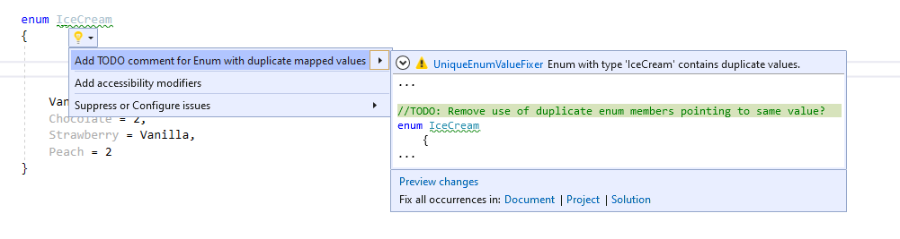

## UniqueEnumValueFixer

This is a codefix warning diagnostics and analyzer built for C# using .NET Compiler SDK (Roslyn).

It contains three projects:
* UniqueEnumValueFixer - .NET Standard 1.3
* UniqueEnumValueFixer.Test - .NET Core 2.0
* 

This extension detects if an enum contains multiple members pointing to same value.
It offers as a codefix to add a TODO comment as a reminder of adjusting this.
If an enum contains multiple members pointing to the same value, this may cause 
ambiguity. 

The following image shows how the extension works. When you compile the solution, it shows the 
code fix like in this example:




Sample code: 

```csharp
 enum IceCream
    {
        Vanilla = 0, 
        Chocolate = 2,
        Strawberry = Vanilla,
        Peach = 2
    }
```

In this example, the enum members of IceCream points to the same value for Strawberry and Vanilla
through assignment and set to same value for Chocolate and Strawberry. 

Enums can contain multiple members set to same value and this usually just causes 
confusion. With this extension, you can easier spot this.

<hr /><br />
Last updated 17.06.2020
Tore Aurstad IT
